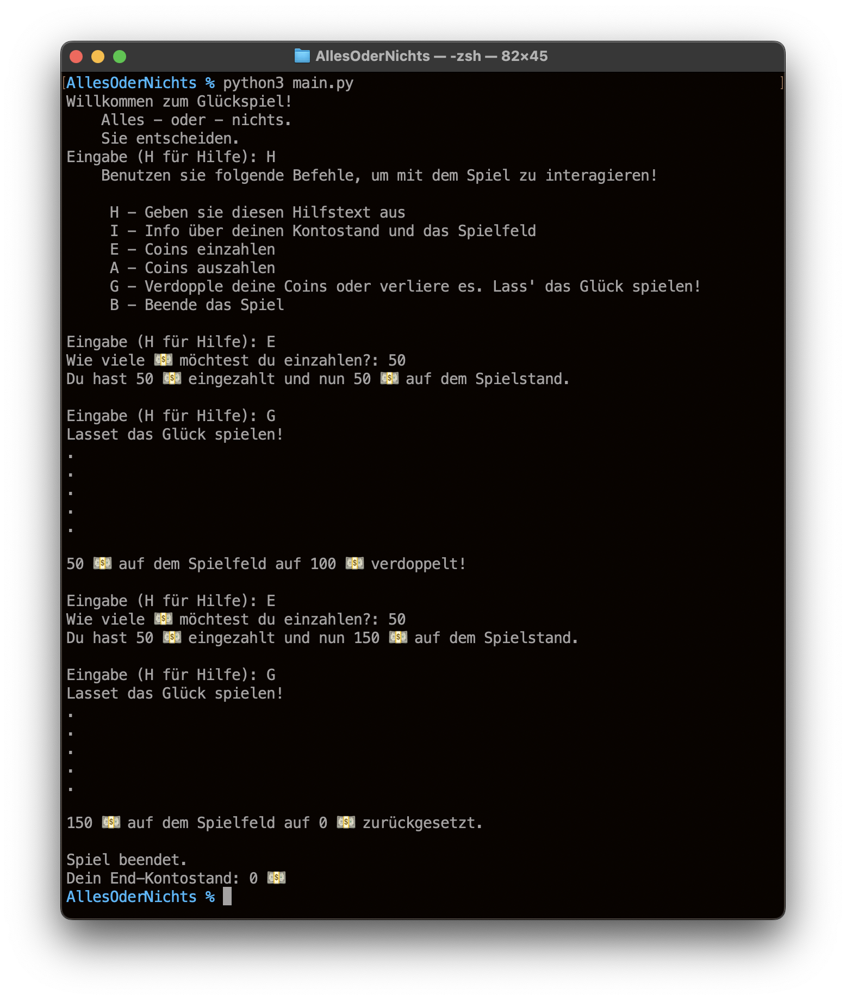

# AllesOderNichts

Hallo,

das hier ist ein kleines Spiel, mal zwischendurch geschrieben.
Um es zu starten, installiere `Python` und starte es, z.B. mit `python main.py`. Keine Pakete werden gebraucht, da das Programm im Command Line Interface läuft.

Es handelt sich um ein Glückspiel: Du hast eine Anfangssumme und willst sie so weit wie möglich vervielfachen! Dafür kannst du Geld aufs Spielfeld setzen und spielen. Verdoppelt sich dein Einsatz? Oder wirst du alles verlieren? Das entscheidet das Spiel. Möge das Glück mit dir sein.

### Gallerie

